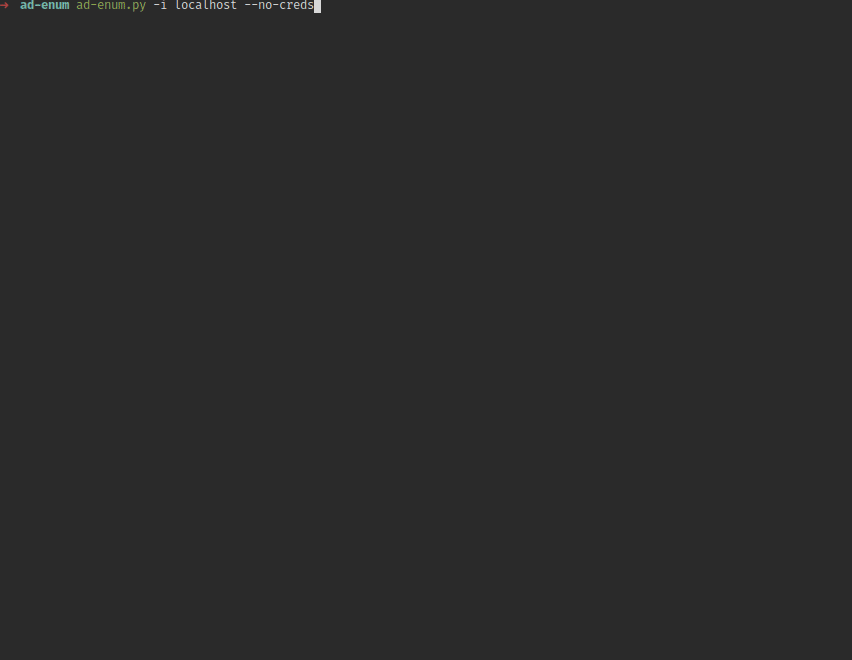
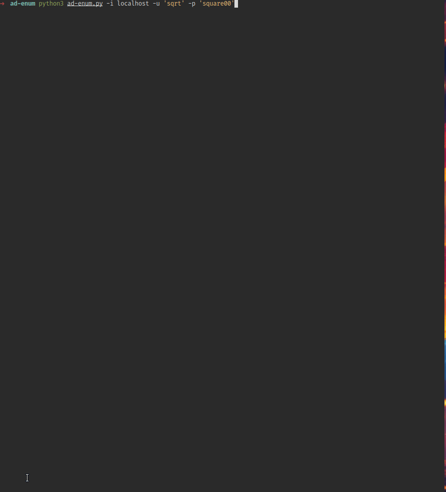

# 🥷 ad-enum

> **An opinionated Active Directory recon tool** built to fast scan, filter noise, and surface what actually matters.<br>
> Made while grinding for **OSCP+**. Tested in pain.<br>
> It's basically a wrapper over `nxc`,`impacket` and other tools to avoid missing common checks

---

## What it does

One script. One target IP. Hits every relevant AD attack surface in seconds.

- **Anonymous recon** — null sessions, guest auth, RID brute, LDAP leak
- **Credential testing** — sprays across SMB, WinRM, RDP, LDAP, SSH, FTP, MSSQL, RPC, WMI, PsExec
- **Pass-the-Hash** — full support across all compatible services
- **Default scan mode** — multi-tool dump (nxc + smbmap + rpcclient + ldapsearch) saved to file
- **Smart output** — green highlight on hit

---

## Demo

> #  **Anonymous / no-creds sweep**



> #  **Credential spray across all services**




---

## Install

```bash
# Clone
git clone https://github.com/youruser/ad-enum && cd ad-enum

# Install dependencies
sudo apt install netexec smbmap ldap-utils smbclient impacket-scripts
pip3 install impacket
```

The script tells you exactly what's missing on first run and lets you continue anyway.

---

## Usage

```bash
# No creds — anonymous enum (null session, guest, RID brute, LDAP)
python3 ad-enum.py -i 10.10.10.10 --no-creds

# Test a set of credentials against every service
python3 ad-enum.py -i 10.10.10.10 -u 'user' -p 'password123'

# Pass-the-Hash
python3 ad-enum.py -i 10.10.10.10 -u administrator -H 8846f7eaee8fb117ad06bdd830b7586c

# Multi-tool dump (nxc + smbmap + rpcclient + ldapsearch)
python3 ad-enum.py -i 10.10.10.10 -u 'user' -p 'password123' --scan

# Target one service only
python3 ad-enum.py -i 10.10.10.10 -u 'user' -p 'password123' smb
```

**Services:** `smb` `ldap` `winrm` `rdp` `mssql` `ftp` `ssh` `rpc` `wmi` `psexec`

---

## ⚖️ Legal

This tool is intended **strictly for authorized penetration testing, CTF competitions, and lab environments** (HackTheBox, TryHackMe, OSCP labs, your own infrastructure).

Using this against systems you do not own or have **explicit written permission** to test is illegal under the Computer Fraud and Abuse Act (CFAA), the Computer Misuse Act, and equivalent laws worldwide.

**The author takes no responsibility for misuse. You are responsible for your own actions.**
